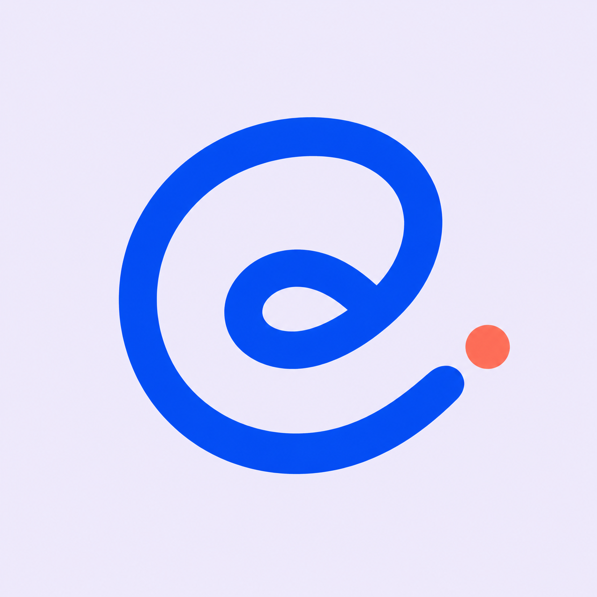
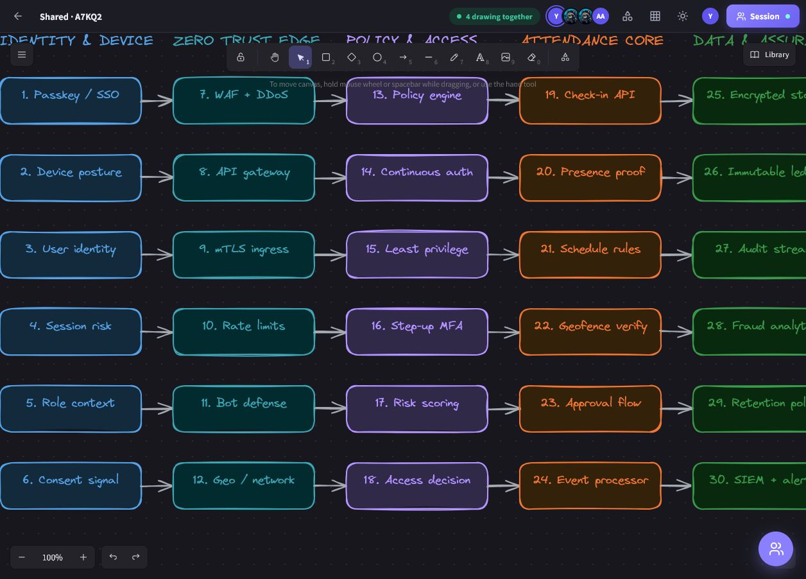
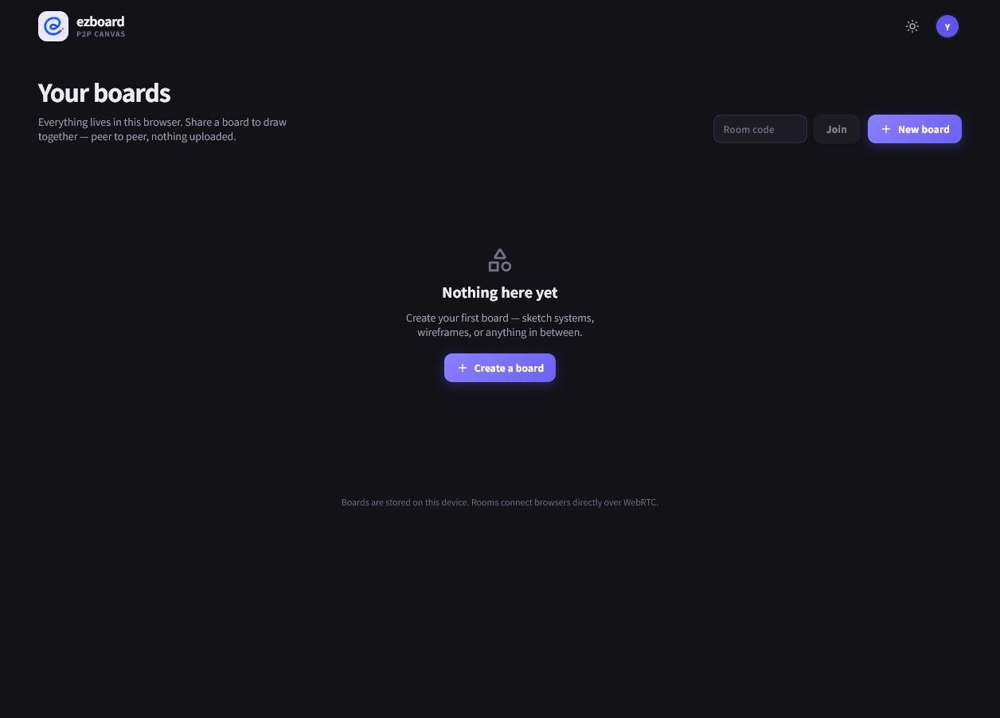
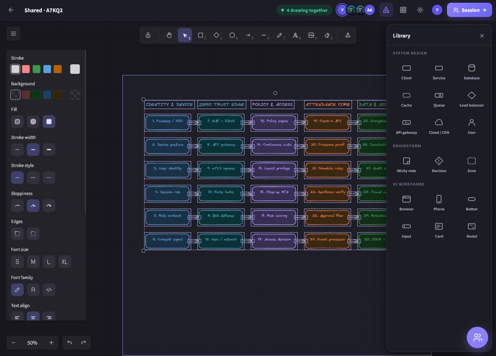
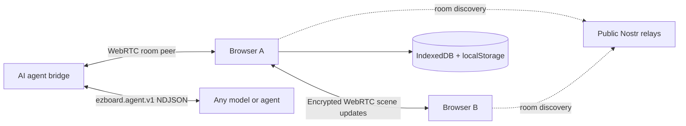

<p align="center">
  
</p>

<h1 align="center">EzBoard</h1>

<p align="center">
  <strong>A private, local-first canvas where people and AI agents draw together.</strong>
</p>

<p align="center">
  Real-time collaboration · Infinite canvas · AI diagramming · No accounts
</p>

<p align="center">
  <a href="https://ezboard.vyasdevgna.online"></a>
  <a href="https://github.com/vyas-devgna/ezboard/actions/workflows/deploy-pages.yml"></a>
  
</p>



## Draw at the speed of thought

EzBoard turns a browser tab into a shared visual workspace. Sketch system designs, map ideas, build wireframes, or invite an AI agent to turn a prompt into a structured Excalidraw diagram. Boards stay on your device and live collaboration travels directly between peers over encrypted WebRTC data channels.

| What you get | How it helps |
|---|---|
| **Infinite Excalidraw canvas** | Draw naturally with shapes, arrows, text, images, laser pointers, and keyboard shortcuts. |
| **Live peer-to-peer rooms** | Share a five-character room code and collaborate without accounts or a hosted board database. |
| **AI collaborator protocol** | Connect any local, hosted, CLI, or IDE agent through provider-neutral NDJSON. |
| **30 featured libraries** | Start quickly with reusable Excalidraw assets plus built-in system, brainstorm, and wireframe stencils. |
| **Local-first persistence** | Boards, profile settings, and theme preferences remain in browser storage. |
| **Production-ready exports** | Export boards as `.excalidraw`, PNG, SVG, or PDF. |

## A focused workspace

<table>
  <tr>
    <td width="50%"></td>
    <td width="50%"></td>
  </tr>
  <tr>
    <td align="center"><strong>Local-first dashboard</strong><br>Boards remain on this device.</td>
    <td align="center"><strong>Built for technical thinking</strong><br>System design, brainstorming, and wireframe components.</td>
  </tr>
</table>

## Start in 30 seconds

1. Open **[ezboard.vyasdevgna.online](https://ezboard.vyasdevgna.online)**.
2. Select **New board** and begin drawing.
3. Select **Share → Start session**.
4. Send the link or room code to collaborators.

No registration, workspace setup, or server configuration is required.

## Architecture



- **Direct collaboration:** Trystero uses public Nostr relays for peer discovery; canvas data then moves through WebRTC data channels.
- **Deterministic convergence:** element versions and nonces resolve concurrent edits without resurrecting deleted objects.
- **Efficient updates:** peers broadcast changed elements and provide a full snapshot when someone joins.
- **Static deployment:** the React application is built by Vite and served from GitHub Pages with a custom domain and enforced HTTPS.

## Connect any AI agent

The bridge does not depend on a specific model vendor. It prints one request as JSON per line and accepts one matching response on stdin.

```bash
cd AI-EZBOARD
npm install
node index.js ROOM_CODE
```

Request:

```json
{"protocol":"ezboard.agent.v1","requestId":"…","input":{"message":"Draw a zero-trust architecture","elements":[]}}
```

Response:

```json
{"requestId":"…","message":"Diagram created","elements":[]}
```

Requests include the current scene, quality constraints, and a unique ID for concurrent work. Responses are validated before being added to the board. The reusable agent instructions live in [`skills/ezboard-agent/SKILL.md`](skills/ezboard-agent/SKILL.md).

## Run locally

Requirements: Node.js 22+ and npm.

```bash
git clone https://github.com/vyas-devgna/ezboard.git
cd ezboard
npm install
npm run dev
```

Quality checks:

```bash
npm run lint
npm run typecheck
npm run test:run
npm run build
```

## Technology

| Layer | Technology |
|---|---|
| Canvas | Excalidraw |
| UI | React 18 + TypeScript |
| Build | Vite 8 |
| Collaboration | Trystero + WebRTC + Nostr discovery |
| Storage | IndexedDB + localStorage |
| AI bridge | Node.js + Puppeteer + NDJSON |
| Hosting | GitHub Pages + GitHub Actions |

## Deploy

Push to `main`; [the Pages workflow](.github/workflows/deploy-pages.yml) installs, lints, type-checks, tests, builds, and deploys the site.

For a custom subdomain:

1. Put the domain in [`public/CNAME`](public/CNAME).
2. Point its DNS `CNAME` record to `vyas-devgna.github.io`.
3. Select **GitHub Actions** as the Pages source.
4. Wait for certificate approval, then enable **Enforce HTTPS**.

If a browser retains an old HTTP warning after GitHub reports an approved certificate, open the explicit `https://` URL and clear that site's cached data.

## Privacy and network limits

EzBoard has no accounts and does not upload boards to an application database. Public discovery relays can observe connection metadata, and direct peer connectivity depends on the networks involved. The current deployment intentionally has no hosted TURN service; restrictive corporate or carrier networks may prevent a room connection.

For a controlled production environment, provide authenticated rendezvous infrastructure and short-lived TURN credentials. Never place permanent TURN credentials in the static client bundle.

## Contributing

Issues and focused pull requests are welcome. Keep changes small, preserve the local-first model, and run the quality checks before submitting.

<p align="center">
  Built by <a href="https://vyasdevgna.online">Devgna Vyas</a> · <a href="https://github.com/sponsors/vyas-devgna">Sponsor the project</a>
</p>
